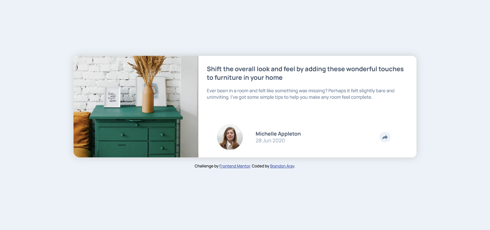

# Frontend Mentor - Article preview component solution

This is a solution to the [Article preview component challenge on Frontend Mentor](https://www.frontendmentor.io/challenges/article-preview-component-dYBN_pYFT). Frontend Mentor challenges help you improve your coding skills by building realistic projects.

## Table of contents

- [Overview](#overview)
  - [The challenge](#the-challenge)
  - [Screenshot](#screenshot)
  - [Links](#links)
- [My process](#my-process)
  - [Built with](#built-with)
  - [What I learned](#what-i-learned)
  - [Continued development](#continued-development)
  - [Useful resources](#useful-resources)
- [Author](#author)

## Overview

### The challenge

Users should be able to:

- View the optimal layout for the component depending on their device's screen size
- See the social media share links when they click the share icon

### Screenshot

### Links

- Solution URL: (https://github.com/branalex94/article-preview-component)
- Live Site URL: [Add live site URL here](https://your-live-site-url.com)

## My process

### Built with

- Semantic HTML5 markup
- CSS custom properties
- Flexbox
- CSS Grid
- Mobile-first workflow
- [React](https://reactjs.org/) - JS library
- [Vite] (https://www.vitejs.dev) - JS Bundle Tool

### What I learned

### Continued development

I'd like to better implement animation and conditional component rendering using react.

### Useful resources

- [Resource 1](https://css-tricks.com/snippets/css/css-triangle/) - This helped me build an arrow for the share popup using only css.

## Author

- GitHub - [branalex94](https://github.com/branalex94)
- Frontend Mentor - [@branalex94](https://www.frontendmentor.io/profile/branalex94)
